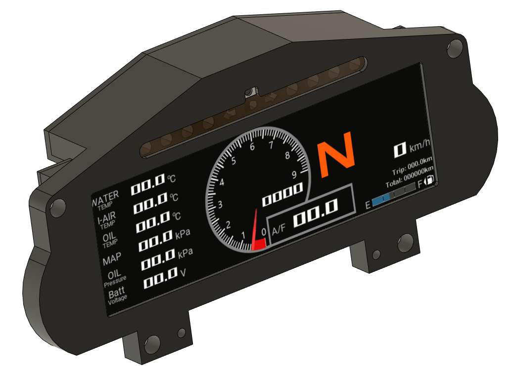
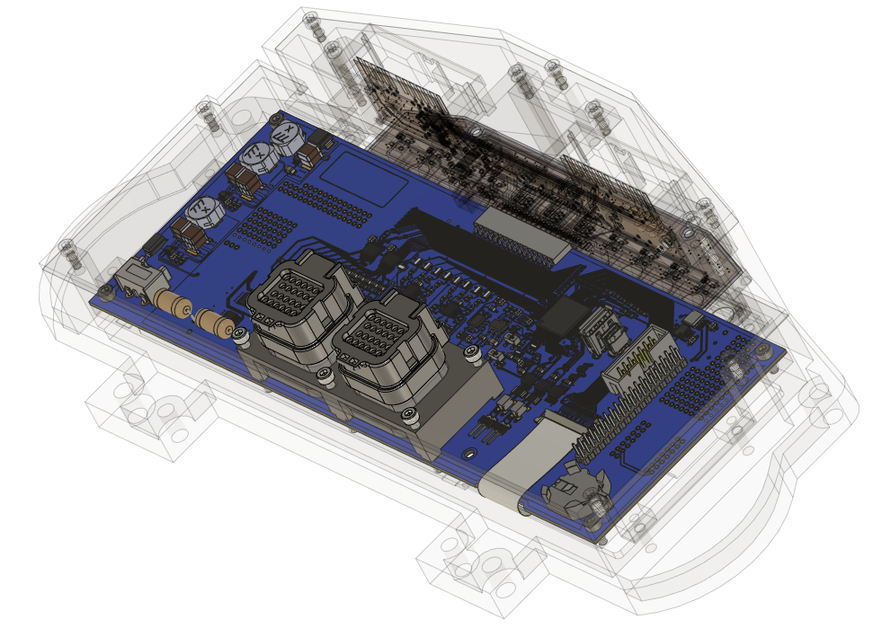

 
## FULLMONI-WIDE
 
 
## プロジェクト概要
FULLMONI-WIDEは自動車用デジタルメーターのオープンハードウェアプロジェクト。  
ECUからCANバス経由で送られる車両情報を受信し、800×256ドットのフルカラー液晶に表示する。  
マツダロードスターNA用の専用筐体に加え、汎用筐体も対象とする。  

## 技術スタック
- **マイコン:** ルネサスRX72N（RXv3コア、240MHz、4MB Flash、1MB SRAM、GLCDC内蔵）  
- **IDE:** Renesas e²studio + GCC-RX  
- **グラフィック:** SEGGER emWin（QE for Display経由、AppWizard対応）  
- **ドライバ:** Smart Configurator生成コードとFITモジュール  
- **周辺機能:** CAN、I²C、ADC、タイマ、外部EEPROM、Neopixel対応LED  

## ディレクトリ構成
- `Firmware/` – マイコン用ファームウェア（C言語）  
- `Hardware/` – 回路図、PCB、筐体設計ファイル  
- `IMG/` – プロジェクト関連画像  
- `debug_env/` – BusMasterによるCANシミュレーション環境  
- `.github/` – CI/CD設定  
- その他プロジェクト設定ファイル、ライセンス、README  

## 主要機能
- エンジン回転数、車速、温度、圧力、電圧のリアルタイム表示  
- 800×256ドット16bitカラー液晶表示、輝度調整機能  
- シフトライト兼警告用RGB LED（Neopixel）×8  
- 外部EEPROMによる走行距離・トリップログ記録  
- アナログ入力最大8ch、車速パルス入力対応  
- 回路・基板設計をMITライセンスで公開  

## 特徴的な設計思想
- 古い車両の絶版部品を現代技術で再生  
- シンプルかつ純正然とした外観を志向  
- 機能性の追求を美観と捉える思想  
- メイン基板・LED基板・インターフェース基板に分けたモジュール設計  
- ハード・ソフトともにオープンソース公開  

## 開発ロードマップ（簡易版）
今後の改善方針と優先順位を示すロードマップ。

- **優先度 高**
  - TypeNモデル開発
  - データ処理・表示処理リファクタリング
  - ユーザリプロ対応（優先）
  - ドキュメント拡充（仕様解説・環境構築・ビルド・書き込み手順）

- **優先度 中**
  - セキュアリプロ対応（OTA）
  - テスト環境強化（BusMasterシナリオ整理、ユニットテスト追加）
  - 拡張ガイド整備（センサ追加手順、GUIテーマカスタマイズ例）

- **優先度 低**
  - 利用事例共有（実車取付例、動作動画）