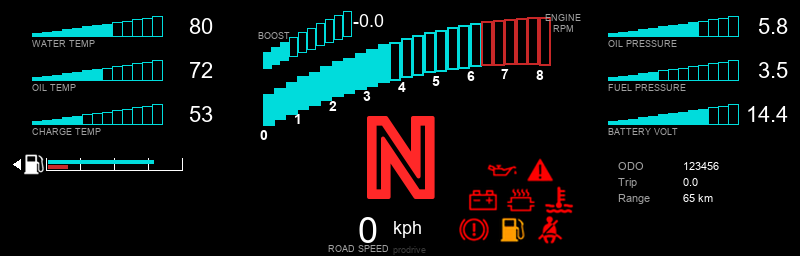

# eez003 Prodrive　P25オマージュ ダッシュボード設計書

## 1. 概要

eez003は、Prodriveレーシングダッシュボードの画面デザインを800×256ピクセルのFULLMONI-WIDE用に再現するデザインバリアント。

**ディスプレイ仕様:**
- 解像度: 800 × 256 px
- ContainerDashboard: x=18, w=765, h=256（eez002と同一）

## 2. リファレンス画像



> 上記モックアップは800×256にスケールした配置図。Prodriveオリジナル(~1270×490)からx*0.63, y*0.52でマッピング。

## 3. レイアウト全体構成

画面を4つのゾーンに分割する:

```
┌─────────────┬──────────────────────────────┬─────────────┐
│  LEFT ZONE  │        CENTER ZONE           │ RIGHT ZONE  │
│  (sensors)  │   (tachometer + gear + ALS)  │  (sensors)  │
│  x: 0-200   │       x: 208-560             │  x: 580-765 │
│  y: 0-155   │       y: 20-170              │  y: 0-155   │
├─────────────┼──────────────────────────────┼─────────────┤
│  FUEL+MODE  │     SPEED + BRANDING         │  ODO/TRIP   │
│  x: 0-200   │       x: 260-470             │  x: 580-765 │
│  y: 155-256  │      y: 195-256             │  y: 160-215 │
└─────────────┴──────────────────────────────┴─────────────┘
```

## 4. 要素一覧と座標（コンテナ内座標）

以下の座標はすべてContainerDashboard内の相対座標（左上原点）。
スクリーン絶対座標は x + 18 で求まる。

### 4.1 LEFT ZONE: 左センサー（3行 — 三角形配置）

| 行 | センサー名 | 対応データ |
|----|-----------|-----------|
| 1  | WATER TEMP | g_CALC_data.waterTemp |
| 2  | OIL TEMP   | g_CALC_data.oilTemp |
| 3  | CHARGE TEMP | g_CALC_data.iat (吸気温) |

バー幅が上から下へ段階的に短くなり、右上がりの三角形を形成:

| Widget | objName | x | y | w | h | 備考 |
|--------|---------|---|---|---|---|------|
| Bar | ui_BarWaterTemp | 14 | 28 | **140** | 8 | 最長バー(上) |
| Name | ui_LblWaterTempName | 14 | 39 | 140 | 12 | "WATER TEMP", 9px gray |
| Value | ui_LblWaterTemp | 162 | 22 | 40 | 28 | "80", Font1 RIGHT_MID |
| Bar | ui_BarOilTemp | 14 | 72 | **110** | 8 | 中間バー |
| Name | ui_LblOilTempName | 14 | 83 | 110 | 12 | "OIL TEMP" |
| Value | ui_LblOilTemp | 162 | 66 | 40 | 28 | "72" |
| Bar | ui_BarChargeTemp | 14 | 116 | **80** | 8 | 最短バー(下) |
| Name | ui_LblChargeTempName | 14 | 127 | 80 | 12 | "CHARGE TEMP" |
| Value | ui_LblChargeTemp | 162 | 110 | 40 | 28 | "53" |

### 4.2 RIGHT ZONE: 右センサー（3行）

| 行 | センサー名 | 対応データ |
|----|-----------|-----------|
| 1  | OIL PRESSURE | g_CALC_data.oilPress |
| 2  | FUEL PRESSURE | g_CALC_data.fuelPress (無ければMAP代用) |
| 3  | BATTERY VOLT | g_CALC_data.battery |

右側はバーが左、数値がその右（リファレンス通り）:

| Widget | objName | x | y | w | h | 備考 |
|--------|---------|---|---|---|---|------|
| Bar | ui_BarOilPress | 600 | 30 | 120 | 8 | セグメント型シアンバー |
| Name | ui_LblOilPressName | 600 | 41 | 120 | 12 | "OIL PRESSURE", 9px gray |
| Value | ui_LblOilPress | 725 | 22 | 40 | 28 | "5.8", Font1(27px) |
| Bar | ui_BarFuelPress | 600 | 75 | 120 | 8 |  |
| Name | ui_LblFuelPressName | 600 | 86 | 120 | 12 | "FUEL PRESSURE" |
| Value | ui_LblFuelPress | 725 | 67 | 40 | 28 | "3.5" |
| Bar | ui_BarBattery | 600 | 120 | 120 | 8 |  |
| Name | ui_LblBatteryName | 600 | 131 | 120 | 12 | "BATTERY VOLT" |
| Value | ui_LblBattery | 725 | 112 | 40 | 28 | "14.4" |

### 4.3 CENTER ZONE: タコメーター

ファン型タコメーターはfan_tacho.cでカスタム描画。
バー先端が**弧状**に右上がりする形状（左:0RPM=短, 右:8000RPM=長）。
曲線: `height = 12 + 115 * sqrt(t)` (t=0、0→t=1.0)

| Widget | objName | x | y | w | h | 備考 |
|--------|---------|---|---|---|---|------|
| Container | ui_ContainerTacho | 215 | 0 | 325 | 170 | fan_tacho.c 描画領域 |
| BOOST label | ui_LblBoost | 225 | 20 | 40 | 12 | "BOOST", 9px gray |
| BOOST value | ui_LblBoostVal | 268 | 14 | 60 | 20 | "-0.0", FontHUDmid |
| ENGINE RPM | ui_LblEngineRpm | 545 | 32 | 50 | 22 | "ENGINE\nRPM", 9px gray |

### 4.4 CENTER: ギア・ALS・警告灯

| Widget | objName | x | y | w | h | font | color | align |
|--------|---------|---|---|---|---|------|-------|-------|
| Gear | ui_LblGear | 365 | 120 | 42 | 48 | FontLARGR(48px) | RED | CENTER |
| ALS | ui_LblALS | 510 | 108 | 55 | 28 | FontHUD30(28px) | CYAN | CENTER |

**警告灯 (Telltales)** — eez002の9個の警告アイコンを中央下側に横一列で配置:

| Widget | objName | x | y | w | h | 備考 |
|--------|---------|---|---|---|---|------|
| Container | ui_ContainerTelltale | 260 | 168 | 252 | 20 | 9アイコンを収容 |
| Icon | ui_ImgWarnMaster | 260 | 168 | 24 | 18 | ws_masterwarning.png |
| Icon | ui_ImgWarnOilPress | 288 | 168 | 24 | 18 | ws_oilpresswarning.png |
| Icon | ui_ImgWarnWaterCold | 316 | 168 | 24 | 18 | ws_watarcool.png |
| Icon | ui_ImgWarnWaterHot | 344 | 168 | 24 | 18 | ws_waterwarning.png |
| Icon | ui_ImgWarnExhaust | 372 | 168 | 24 | 18 | ws_exhaustwarning.png |
| Icon | ui_ImgWarnBattery | 400 | 168 | 24 | 18 | ws_batterywarning.png |
| Icon | ui_ImgWarnBrake | 428 | 168 | 24 | 18 | ws_breakwarning.png |
| Icon | ui_ImgWarnBelt | 456 | 168 | 24 | 18 | ws_beltwarning.png |
| Icon | ui_ImgWarnFuel | 484 | 168 | 24 | 18 | ws_fuelcheck.png |

### 4.5 BOTTOM LEFT: 燃料ゲージ + モードセレクタ

| Widget | objName | x | y | w | h | 備考 |
|--------|---------|---|---|---|---|------|
| Fuel icon | ui_LblFuelIcon | 14 | 158 | 16 | 16 | ⛽アイコン |
| Fuel bar | ui_BarFuel | 34 | 161 | 130 | 8 | 0-100 range, セグメント型 |
| Fuel E label | ui_LblFuelE | 28 | 171 | 10 | 10 | "E" |
| Fuel F label | ui_LblFuelF | 158 | 171 | 10 | 10 | "F" |
| Mode label | ui_LblMode | 55 | 182 | 40 | 14 | "Mode", gray |
| ROAD | ui_LblModeRoad | 40 | 182 | 40 | 10 | "ROAD", dim (非表示切替) |
| SPORT | ui_LblModeSport | 40 | 182 | 52 | 10 | "SPORT", dim (非表示切替) |
| SPORT+ border | ui_ModeBorder | 30 | 196 | 135 | 22 | cyan枠 |
| SPORT+ label | ui_LblModeSportPlus | 55 | 198 | 80 | 18 | "SPORT+", cyan FontHUDmid |
| Deco line | ui_LineDeco | 165 | 207 | 175 | 1 | 水平装飾線 |

### 4.6 BOTTOM CENTER: 速度 + ブランディング

| Widget | objName | x | y | w | h | font | 備考 |
|--------|---------|---|---|---|---|------|------|
| Speed value | ui_LblSpd | 310 | 210 | 60 | 36 | FontLARGR(36px) | "0", "180" etc. |
| Speed unit | ui_LblSpdUnit | 345 | 217 | 40 | 18 | FontHUDmid | "kph" |
| ROAD SPEED | ui_LblRoadSpeed | 315 | 243 | 100 | 10 | 9px gray | |
| P brake | ui_LblParking | 445 | 212 | 18 | 18 | — | Ⓟアイコン(赤丸) |
| Branding | ui_LblProdrive | 340 | 244 | 100 | 12 | FontHUDmid gray | "prodrive" |

### 4.7 BOTTOM RIGHT: ODO/Trip/Range

| Widget | objName | x | y | w | h | font |
|--------|---------|---|---|---|---|------|
| ODO name | ui_LblOdoName | 600 | 160 | 55 | 14 | 11px gray |
| ODO value | ui_LblOdo | 665 | 160 | 90 | 14 | FontHUDmid |
| Trip name | ui_LblTripName | 600 | 176 | 55 | 14 | 11px gray |
| Trip value | ui_LblTrip | 665 | 176 | 90 | 14 | FontHUDmid |
| Range name | ui_LblRangeName | 600 | 192 | 55 | 14 | 11px gray |
| Range value | ui_LblRange | 665 | 192 | 90 | 14 | FontHUDmid |

## 5. カラースキーム

| 用途 | 色コード | 説明 |
|------|---------|------|
| 主テキスト | #FFFFFF | 数値、速度 |
| 補助テキスト | #A0A0A0 | ラベル名、単位 |
| ギア文字 | #FF2828 | 赤 (ニュートラル時) |
| シアンアクセント | #00DCDC | ALS、SPORT+、バー |
| バー背景 | #2B2B2B | ダークグレー |
| バー値 | #00B4B4 | シアン |
| バー警告 | #FF2828 | レッドライン |
| 枠色 | #00C8B4 | SPORT+ボーダー |

## 6. フォント一覧

| フォント名 | サイズ | 用途 |
|-----------|-------|------|
| FontLARGR | 72px | ギア表示 |
| FontHUD36 | 36px | 速度 |
| FontHUD30 | 30px | RPM値 |
| Font1 | 27px | センサー数値（左右6つ） |
| FontHUDmid | 18px | Time, Trip, ODO, AFR, 小テキスト |
| Small (new?) | 10px | センサー名ラベル、ROAD SPEED等 |

> 10pxフォントはeez002には無い。代替案:
> - FontHUDmid(18px)で代用し、センサー名を省略/縮小
> - 新規10pxフォントをgen_lvgl_fonts.pyで生成

## 7. eez002との差異

| 項目 | eez002 | eez003 |
|------|--------|--------|
| センサー配置 | 左6行(一列) | 左3行 + 右3行(ミラー) |
| センサー名ラベル | なし | あり(バー下に小文字) |
| BOOST | なし | あり(タコ上部) |
| ALS表示 | なし | あり(シアン) |
| Mode/SPORT+ | なし | あり(左下) |
| 燃料ゲージ位置 | 右下 | 左下 |
| ROAD SPEEDラベル | なし | あり(速度下) |
| Pブレーキ | なし | あり |
| prodriveブランド | なし | あり(最下部中央) |
| Range表示 | なし | あり |
| AFR | センター下寄り | 省略 (将来追加可) |
| TIME | 上部中央 | 省略 (将来追加可) |
| 装飾線 | なし | あり(SPORT+→右) |
| タコメーター | ArcWidget + 画像 | fan_tacho.c カスタム描画 |
| 右側バー方向 | — | 逆方向(右端から左へフィル) |

## 8. screens.h ウィジェット対応表

既存のscreens.hのメンバー名 → .eez-project内のobjNameマッピング:

| screens.h メンバー | .eez-project objName | 型 |
|-------------------|---------------------|-----|
| ui_container_dashboard | ui_ContainerDashboard | Panel |
| ui_container_tacho | ui_ContainerTacho | Panel |
| ui_lbl_boost | ui_LblBoost | Label |
| ui_lbl_boost_val | ui_LblBoostVal | Label |
| ui_lbl_engine_rpm | ui_LblEngineRpm | Label |
| ui_bar_water_temp | ui_BarWaterTemp | Bar |
| ui_lbl_water_temp | ui_LblWaterTemp | Label |
| ui_lbl_water_temp_name | ui_LblWaterTempName | Label |
| ui_bar_oil_temp | ui_BarOilTemp | Bar |
| ui_lbl_oil_temp | ui_LblOilTemp | Label |
| ui_lbl_oil_temp_name | ui_LblOilTempName | Label |
| ui_bar_charge_temp | ui_BarChargeTemp | Bar |
| ui_lbl_charge_temp | ui_LblChargeTemp | Label |
| ui_lbl_charge_temp_name | ui_LblChargeTempName | Label |
| ui_bar_oil_press | ui_BarOilPress | Bar |
| ui_lbl_oil_press | ui_LblOilPress | Label |
| ui_lbl_oil_press_name | ui_LblOilPressName | Label |
| ui_bar_fuel_press | ui_BarFuelPress | Bar |
| ui_lbl_fuel_press | ui_LblFuelPress | Label |
| ui_lbl_fuel_press_name | ui_LblFuelPressName | Label |
| ui_bar_battery | ui_BarBattery | Bar |
| ui_lbl_battery | ui_LblBattery | Label |
| ui_lbl_battery_name | ui_LblBatteryName | Label |
| ui_lbl_gear | ui_LblGear | Label |
| ui_lbl_als | ui_LblALS | Label |
| ui_lbl_spd | ui_LblSpd | Label |
| ui_lbl_spd_unit | ui_LblSpdUnit | Label |
| ui_lbl_road_speed | ui_LblRoadSpeed | Label |
| ui_lbl_parking | ui_LblParking | Label |
| ui_bar_fuel | ui_BarFuel | Bar |
| ui_lbl_fuel_icon | ui_LblFuelIcon | Label |
| ui_lbl_mode | ui_LblMode | Label |
| ui_lbl_mode_road | ui_LblModeRoad | Label |
| ui_lbl_mode_sport | ui_LblModeSport | Label |
| ui_lbl_mode_sport_plus | ui_LblModeSportPlus | Label |
| ui_mode_border | ui_ModeBorder | Panel |
| ui_lbl_odo_name | ui_LblOdoName | Label |
| ui_lbl_odo | ui_LblOdo | Label |
| ui_lbl_trip_name | ui_LblTripName | Label |
| ui_lbl_trip | ui_LblTrip | Label |
| ui_lbl_range_name | ui_LblRangeName | Label |
| ui_lbl_range | ui_LblRange | Label |
| ui_lbl_prodrive | ui_LblProdrive | Label |
| ui_line_deco | ui_LineDeco | Panel (1px height) |

## 9. 実装計画

### Phase 1: .eez-project 再生成
1. `_rebuild_eez003_v5.py` スクリプトを本設計書の座標表に基づいて新規作成
2. EEZ座標変換関数で上記コンテナ内座標→EEZ offset座標に変換
3. 実行してeez003.eez-projectを上書き
4. EEZ Studioで開いて目視確認

### Phase 2: screens.c 更新
1. 上記ウィジェット対応表に基づきscreens.cのcreate関数を完全リライト
2. 右側バー（逆方向フィル）の実装
3. Mode切替用のボーダー付きパネル実装

### Phase 3: eez_compat.h 更新
1. PascalCase → snake_case マクロマッピングを対応表通りに更新

### Phase 4: ui_dashboard.c 更新
1. 新しいデータバインディング（BOOST値計算、Mode切替等）
2. fan_tacho連携確認

### Phase 5: ビルド＆検証
1. ファームウェアビルド
2. EEZ Studioプレビューとの一致確認

## 10. 未解決事項

- [ ] 10pxフォントの追加が必要か（既存FontHUDmid 18pxで代用するか）
- [ ] FUEL PRESSURE データソースの有無（MAPで代用するか）
- [ ] Range計算ロジック（燃費×残燃料？）
- [ ] Mode切替のトリガー（CAN信号？ボタン？固定表示？）
- [ ] ALS表示条件（CAN信号？常時表示？）
- [ ] Pブレーキアイコンの実装方法（テキスト "P" or 画像?）
- [ ] AFR + TIME を追加するか（Prodriveオリジナルには無いが有用）
